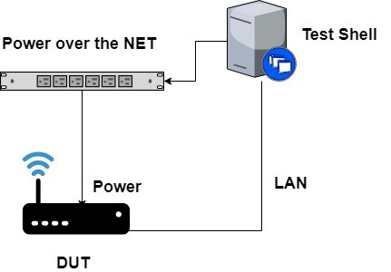
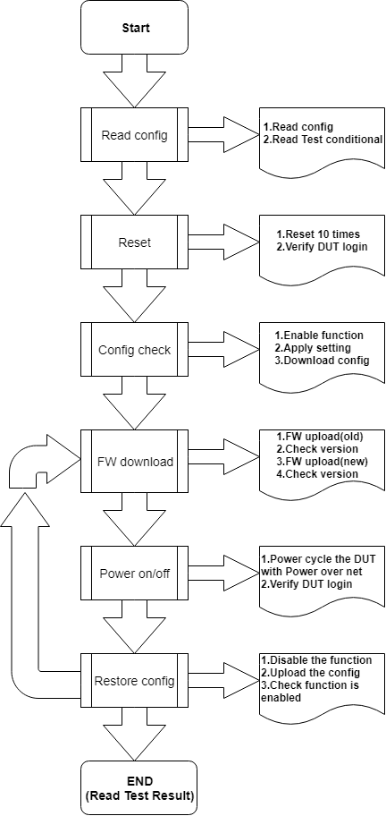
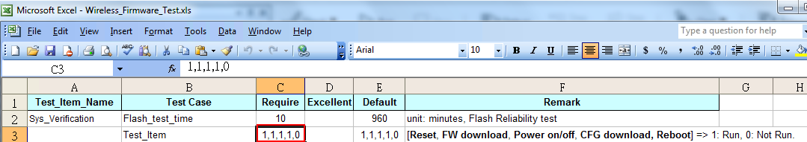
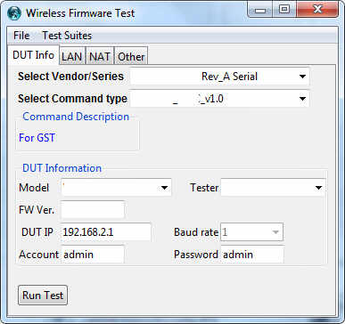
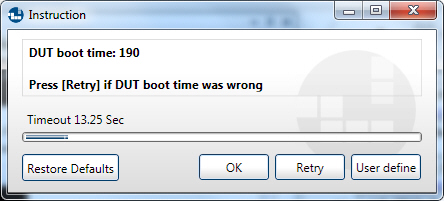
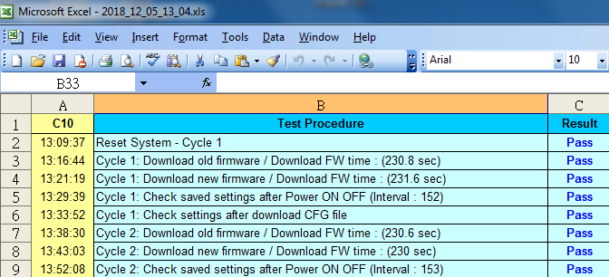

# Flash-Reliability
Created from Testshell automation system
--------------
* ### About the Project
* Case request: 測試不斷寫入產品flash , 在長時間的測試中是否正常
* 原有的系統只support Command Line Interface的介面,如果遇到用純web的方式設定的產品,會無法測試
  因此討論過後需要增加用Python selenium的方式去做設定
  

--------------
* ### Topology
  
  
  
  
  
* ### Setup and Run
  
  * 設定config
    
    
  * 執行
    
    
    
  * boot time  
    中間會跳出DUT重開機的訊息,秒數可以客製
    
    
    
    
* ### Result
  
  
