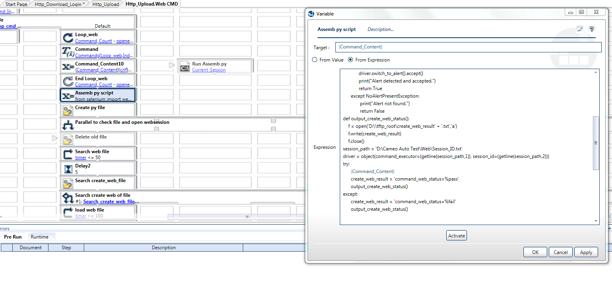

# Flash-Reliability
Created from Testshell automation system
--------------
* ### About the Project (測試不斷寫入產品flash , 在長時間的測試中是否正常)
* Case request: 
* 因原有的系統只support Command Line Interface的介面,如果遇到用純web的方式設定的產品,會無法測試
  因此討論過後需要增加用Python selenium的方式去做設定,修改相關module可以支援
  

--------------
* ### Topology
  
  
  
  
  
* ### Setup and Run
  
  * 設定config
    
  
  * 部分實做畫面
    
  
  * 執行
    
    
    
  * boot time
    
    中間會跳出DUT重開機的訊息,秒數可以客製
    
    
    
    
* ### Result
  
  
* ### Troubleshooting
  在長時間的測試中,工作管理員的chrome越開越多,暫存的temp也越來越多,到後面硬碟就爆了
  driver.close driver.quit 皆不行,參考網路文章,可以強制把process關掉即可解決,每一次跑完執行一次kill_process.py
  順便清理完temp檔
  
```
import glob, os, shutil
import psutil

def kill_chrome():
      PROCNAME1 = "chrome.exe"
      for proc in psutil.process_iter():
      # check whether the process name matches
            if proc.name() == PROCNAME1:
                  proc.kill()
      
def killprocess():
      PROCNAME = "chromedriver.exe"
      for proc in psutil.process_iter():
      # check whether the process name matches
            if proc.name() == PROCNAME:
                  proc.kill()

if __name__ == '__main__':
      try:
            kill_chrome()
            killprocess()
            print("kill chromedriver.exe of process")
            file_path = (os.environ['USERPROFILE']+'\AppData\Local\Temp\scoped*')
            dirs = glob.glob(file_path)
            for dir in dirs:
                  shutil.rmtree(dir)
                  print("Selenium temp files is deleted")
            
      except PermissionError:
            print("PremissionError,because the file is used. Please ignore it")
  ```
